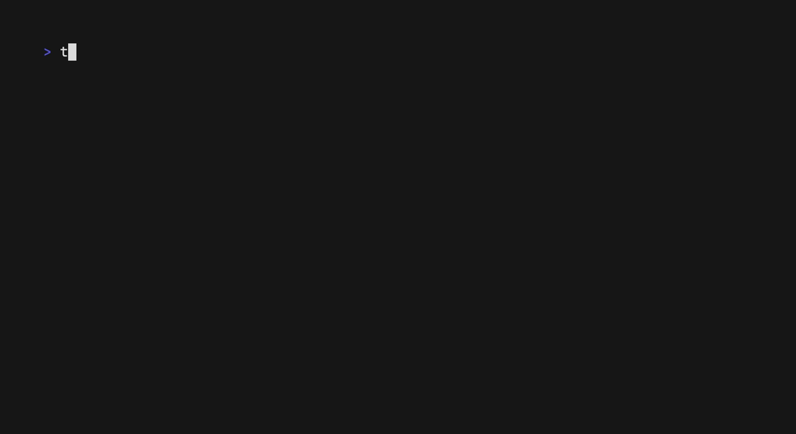

# twe

Timewarrior extensions for power users, including an interactive TUI and a Go package for writing your own extensions.

## Installation

Install the executable and necessary extensions using `make`:

```
make install
```

## Usage

### Edit


`twe edit` runs an interactive TUI for editing Timewarrior data.  Updates are committed to Timewarrior as you make them. Use the following controls to interact with your data:

- `h/j/k/l` (or arrow keys) to move around the table. 
- `a` to add a new interval.
- `d` to delete the currently selected interval. 
- `u` to undo the last edit.
- `Enter/e` to edit the currently selected field.
- `Enter/Esc` when finished editing the currently selected field. 

You can also specify a day to edit using a subset of [Timewarrior's date syntax](https://timewarrior.net/docs/dates/):

```bash
# Specify a relative date
twe edit today
twe edit tomorrow
twe edit yesterday

# ... or a specific day of the current week
twe edit sunday
twe edit sun

# ... or a specific date
twe edit 2025-01-01
twe edit 20250101
```

### Timecard 



`twe timecard` prints a report of the hours / day dedicated to each tag within the specified time range. Supports [Timewarrior's date syntax](https://timewarrior.net/docs/dates/) for specifying time ranges. 

```bash
# Timecard from the current week
twe timecard

# Timecard from last week
twe timecard :lastweek

# Timecard from specified date range
twe timecard 2024-01-01 - 2024-01-08
```

### Import

`twe import` allows you to import a JSON-formatted array of intervals from into Timewarrior. Useful for importing intervals made in another system into Timewarrior, or even copying intervals from one `TIMEWARRIORDB` to another.

```bash
# Import from a file
twe import -f week.json

# ...or from STDIN
timew export :week | vipe | twe import
```

## Package

Documentation for the Golang package is available on [pkg.go.dev](https://pkg.go.dev/github.com/kgoettler/twe)